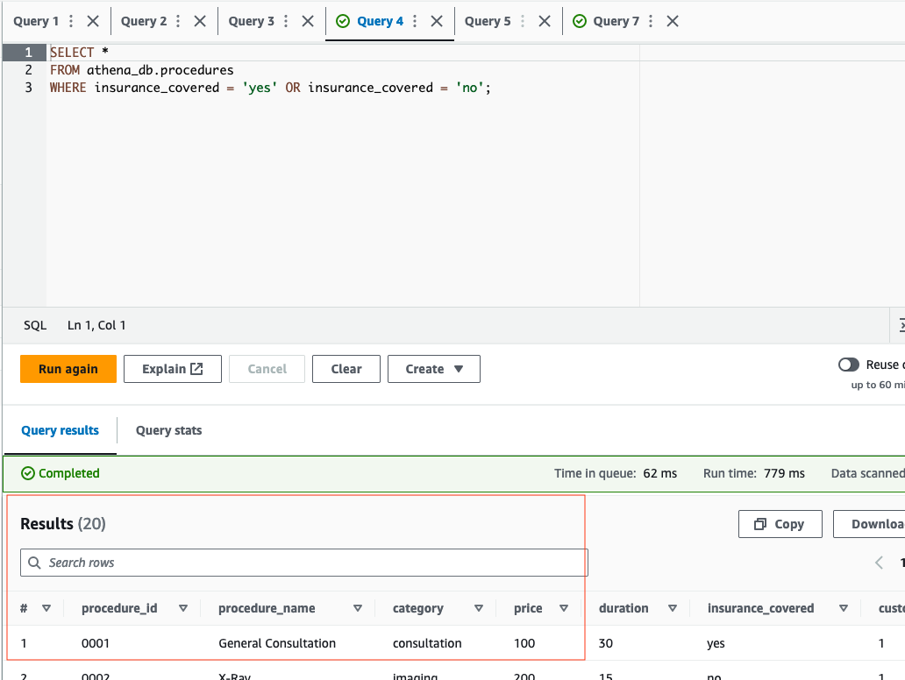
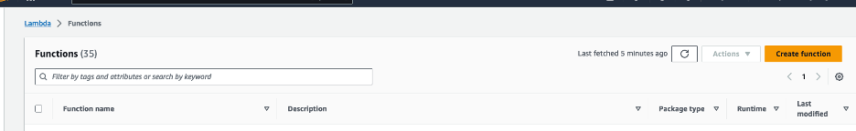
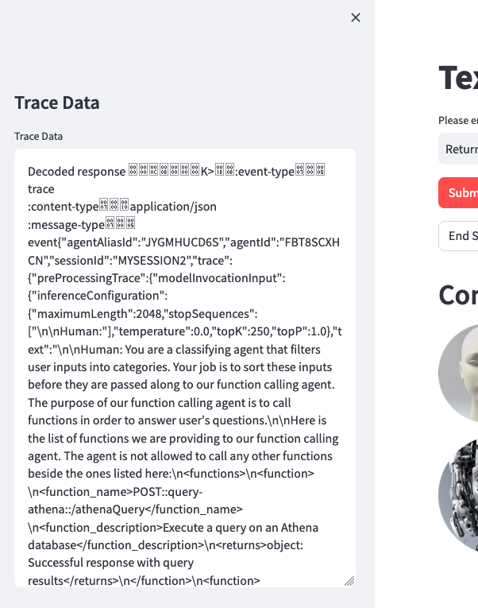

# Configuração do Amazon Bedrock Agent para Text2SQL usando Amazon Athena com Streamlit

## Introdução
Vamos configurar um agente do Amazon Bedrock com um grupo de ações que será capaz de traduzir linguagem natural para consultas SQL. Neste projeto, estaremos consultando um banco de dados do Amazon Athena, mas o conceito pode ser aplicado à maioria dos bancos de dados SQL.

## Pré-requisitos
- Uma conta AWS ativa.
- Familiaridade com serviços AWS como Amazon Bedrock, Amazon S3, AWS Lambda, Amazon Athena e Amazon Cloud9.
- O acesso precisará ser concedido ao modelo **Anthropic: Claude 3 Haiku** no console do Amazon Bedrock.

## Diagrama


## Configuração e Setup

### Passo 1: Conceder Acesso ao Modelo

- Precisaremos conceder acesso aos modelos que serão necessários para nosso agente Bedrock. Navegue até o console do Amazon Bedrock, então no lado esquerdo da tela, role para baixo e selecione **Model access**. À direita, selecione o botão laranja **Manage model access**.


- Selecione a caixa de seleção para a coluna do modelo base **Anthropic: Claude 3 Haiku**. Isso fornecerá acesso aos modelos necessários. Depois, role para baixo até o canto inferior direito e selecione **Request model access**.

- Depois, verifique se o status de acesso dos modelos está verde com **Access granted**.


### Passo 2: Criando Buckets S3
- Certifique-se de estar na região **us-west-2**. Se outra região for necessária, você precisará atualizar a região no arquivo `InvokeAgent.py` na linha 24 do código.
- **Bucket de Dados de Domínio**: Crie um bucket S3 para armazenar os dados de domínio. Por exemplo, chame o bucket S3 de `athena-datasource-{alias}`. Usaremos as configurações padrão.
(Certifique-se de atualizar **{alias}** com o valor apropriado ao longo das instruções do README.)


- Em seguida, baixaremos arquivos .csv que contêm dados simulados para clientes e procedimentos. Abra um terminal ou prompt de comando e execute os seguintes comandos `curl` para baixar e salvar esses arquivos na pasta **Documents**:

Para **Mac**
```linux
curl https://raw.githubusercontent.com/build-on-aws/bedrock-agent-txt2sql/main/S3data/mock-data-customers.csv --output ~/Documents/mock-data-customers.csv

curl https://raw.githubusercontent.com/build-on-aws/bedrock-agent-txt2sql/main/S3data/mock-data-procedures.csv --output ~/Documents/mock-data-procedures.csv
```

Para **Windows**

```windows
curl https://raw.githubusercontent.com/build-on-aws/bedrock-agent-txt2sql/main/S3data/mock-data-customers.csv --output %USERPROFILE%\Documents\mock-data-customers.csv

curl https://raw.githubusercontent.com/build-on-aws/bedrock-agent-txt2sql/main/S3data/mock-data-procedures.csv --output %USERPROFILE%\Documents\mock-data-procedures.csv
```

- Esses arquivos são a fonte de dados para o Amazon Athena. Faça upload desses arquivos para o bucket S3 `athena-datasource-{alias}`. Depois que os documentos forem carregados, revise-os.


- **Bucket do Amazon Athena**: Crie outro bucket S3 para o serviço Athena. Chame-o de `athena-destination-store-{alias}`. Você precisará usar este bucket S3 ao configurar o Amazon Athena no próximo passo.

### Passo 3: Configurar o Amazon Athena

- Procure pelo serviço Amazon Athena e navegue até o console de gerenciamento do Athena. Valide se o botão de opção **Query your data with Trino SQL** está selecionado, então pressione **Launch query editor**.


- Antes de executar sua primeira consulta no Athena, você precisa configurar um local de resultado de consulta com o Amazon S3. Selecione a aba **Settings**, depois o botão **Manage** na seção **Query result location and encryption**.


- Adicione o prefixo S3 abaixo para o local dos resultados da consulta, depois selecione o botão Save:

```text
s3://athena-destination-store-{alias}
```


- Em seguida, criaremos um banco de dados Athena. Selecione a aba **Editor**, depois copie/cole a seguinte consulta na tela de consulta vazia. Depois, selecione Run:

```sql
CREATE DATABASE IF NOT EXISTS athena_db;
```


- Você deve ver "query successful" na parte inferior. No lado esquerdo sob **Database**, mude o banco de dados padrão para `athena_db`, se não estiver por padrão.

- Precisaremos criar a tabela `customers`. Execute a seguinte consulta no Athena. `(Lembre-se de atualizar o campo {alias})`:

```sql
CREATE EXTERNAL TABLE athena_db.customers (
  `Cust_Id` integer,
  `Customer` string,
  `Balance` integer,
  `Past_Due` integer,
  `Vip` string
)
ROW FORMAT DELIMITED 
FIELDS TERMINATED BY ',' 
LINES TERMINATED BY '\n'
STORED AS TEXTFILE
LOCATION 's3://athena-datasource-{alias}/';
```

- Abra outra aba de consulta e crie a tabela `procedures` executando esta consulta. `(Lembre-se de atualizar o campo {alias})`:

```sql
CREATE EXTERNAL TABLE athena_db.procedures (
  `Procedure_Id` string,
  `Procedure` string,
  `Category` string,
  `Price` integer,
  `Duration` integer,
  `Insurance` string,
  `Customer_Id` integer
)
ROW FORMAT DELIMITED 
FIELDS TERMINATED BY ',' 
LINES TERMINATED BY '\n'
STORED AS TEXTFILE
LOCATION 's3://athena-datasource-{alias}/';
```

- Suas tabelas para Athena dentro do editor devem parecer similares ao seguinte:


- Agora, vamos testar rapidamente as consultas contra as tabelas customers e procedures executando as duas consultas de exemplo abaixo:

```sql
SELECT *
FROM athena_db.procedures
WHERE insurance = 'yes' OR insurance = 'no';
```



```sql
SELECT * 
FROM athena_db.customers
WHERE balance >= 0;
```


- Se os testes foram bem-sucedidos, podemos passar para o próximo passo.

### Passo 4: Configuração da Função Lambda
- Crie uma função Lambda (Python 3.12) para o grupo de ações do agente Bedrock. Chamaremos esta função Lambda de `bedrock-agent-txtsql-action`.




- Copie o código fornecido [aqui](https://github.com/build-on-aws/bedrock-agent-txt2sql/blob/main/function/lambda_function.py), ou do código abaixo para a função Lambda.

```python
import boto3
from time import sleep

# Initialize the Athena client
athena_client = boto3.client('athena')

def lambda_handler(event, context):
    print(event)

    def athena_query_handler(event):
        # Fetch parameters for the new fields

        # Extracting the SQL query
        query = event['requestBody']['content']['application/json']['properties'][0]['value']

        print("the received QUERY:",  query)
        
        s3_output = 's3://athena-destination-store-alias'  # Replace with your S3 bucket

        # Execute the query and wait for completion
        execution_id = execute_athena_query(query, s3_output)
        result = get_query_results(execution_id)

        return result

    def execute_athena_query(query, s3_output):
        response = athena_client.start_query_execution(
            QueryString=query,
            ResultConfiguration={'OutputLocation': s3_output}
        )
        return response['QueryExecutionId']

    def check_query_status(execution_id):
        response = athena_client.get_query_execution(QueryExecutionId=execution_id)
        return response['QueryExecution']['Status']['State']

    def get_query_results(execution_id):
        while True:
            status = check_query_status(execution_id)
            if status in ['SUCCEEDED', 'FAILED', 'CANCELLED']:
                break
            sleep(1)  # Polling interval

        if status == 'SUCCEEDED':
            return athena_client.get_query_results(QueryExecutionId=execution_id)
        else:
            raise Exception(f"Query failed with status '{status}'")

    action_group = event.get('actionGroup')
    api_path = event.get('apiPath')

    print("api_path: ", api_path)

    result = ''
    response_code = 200

    if api_path == '/athenaQuery':
        result = athena_query_handler(event)
    else:
        response_code = 404
        result = {"error": f"Unrecognized api path: {action_group}::{api_path}"}

    response_body = {
        'application/json': {
            'body': result
        }
    }

    action_response = {
        'actionGroup': action_group,
        'apiPath': api_path,
        'httpMethod': event.get('httpMethod'),
        'httpStatusCode': response_code,
        'responseBody': response_body
    }

    api_response = {'messageVersion': '1.0', 'response': action_response}
    return api_response
```

- Em seguida, atualize o valor **alias** para a variável `s3_output` no código python acima. Depois, selecione **Deploy** sob **Code source** no console Lambda. Revise o código fornecido antes de passar para o próximo passo.


- Now, we need to apply a resource policy to Lambda that grants Bedrock agent access. To do this, we will switch the top tab from **code** to **configuration** and the side tab to **Permissions**. Then, scroll to the **Resource-based policy statements** section and click the **Add permissions** button.


- Enter `arn:aws:bedrock:us-west-2:{aws-account-id}:agent/* `. ***Please note, AWS recommends least privilage so only the allowed agent can invoke this Lambda function***. A `*` at the end of the ARN grants any agent in the account access to invoke this Lambda. Ideally, we would not use this in a production environment. Lastly, for the Action, select `lambda:InvokeAction`, then ***Save***.


- We also need to provide this Lambda function permissions to interact with an S3 bucket, and Amazon Athena service. While on the `Configuration` tab -> `Permissions` section, select the Role name:


- Select `Add permissions -> Attach policies`. Then, attach the AWS managed policies ***AmazonAthenaFullAccess***,  and ***AmazonS3FullAccess*** by selecting, then adding the permissions. Please note, in a real world environment, it's recommended that you practice least privilage.


- The last thing we need to do with the Lambda is update the configurations. Navigate to the `Configuration` tab, then `General Configuration` section on the left. From here select Edit.


- Update the memory to 1024 MB, and Timeout to 1 minute. Scroll to the bottom, and save the changes.


- We are now done setting up the Lambda function


### Step 5: Setup Bedrock agent and action group 
- Navigate to the Bedrock console. Go to the toggle on the left, and under **Orchestration** select ***Agents***, then ***Create Agent***. Provide an agent name, like `athena-agent` then ***Create***.


- The agent description is optional, and use the default new service role. For the model, select **Anthropic Claude 3 Haiku**. Next, provide the following instruction for the agent:


```instruction
Role: You are a SQL developer creating queries for Amazon Athena.

Objective: Generate SQL queries to return data based on the provided schema and user request. Also, returns SQL query created.

1. Query Decomposition and Understanding:
   - Analyze the user’s request to understand the main objective.
   - Break down reqeusts into sub-queries that can each address a part of the user's request, using the schema provided.

2. SQL Query Creation:
   - For each sub-query, use the relevant tables and fields from the provided schema.
   - Construct SQL queries that are precise and tailored to retrieve the exact data required by the user’s request.

3. Query Execution and Response:
   - Execute the constructed SQL queries against the Amazon Athena database.
   - Return the results exactly as they are fetched from the database, ensuring data integrity and accuracy. Include the query generated and results in the response.
```

It should look similar to the following: 


- Scroll to the top, then select ***Save***.

- Keep in mind that these instructions guide the generative AI application in its role as a SQL developer creating efficient and accurate queries for Amazon Athena. The process involves understanding user requests, decomposing them into manageable sub-queries, and executing these to fetch precise data. This structured approach ensures that responses are not only accurate but also relevant to the user's needs, thereby enhancing user interaction and data retrieval efficiency.


- Next, we will add an action group. Scroll down to `Action groups` then select ***Add***.

- Call the action group `query-athena`. We will keep `Action group type` set to ***Define with API schemas***. `Action group invocations` should be set to ***select an existing Lambda function***. For the Lambda function, select `bedrock-agent-txtsql-action`.

- For the `Action group Schema`, we will choose ***Define with in-line OpenAPI schema editor***. Replace the default schema in the **In-line OpenAPI schema** editor with the schema provided below. You can also retrieve the schema from the repo [here](https://github.com/build-on-aws/bedrock-agent-txt2sql/blob/main/schema/athena-schema.json). After, select ***Add***.
`(This API schema is needed so that the bedrock agent knows the format structure and parameters needed for the action group to interact with the Lambda function.)`

```schema
{
  "openapi": "3.0.1",
  "info": {
    "title": "AthenaQuery API",
    "description": "API for querying data from an Athena database",
    "version": "1.0.0"
  },
  "paths": {
    "/athenaQuery": {
      "post": {
        "description": "Execute a query on an Athena database",
        "requestBody": {
          "description": "Athena query details",
          "required": true,
          "content": {
            "application/json": {
              "schema": {
                "type": "object",
                "properties": {
                  "Procedure ID": {
                    "type": "string",
                    "description": "Unique identifier for the procedure",
                    "nullable": true
                  },
                  "Query": {
                    "type": "string",
                    "description": "SQL Query"
                  }
                }
              }
            }
          }
        },
        "responses": {
          "200": {
            "description": "Successful response with query results",
            "content": {
              "application/json": {
                "schema": {
                  "type": "object",
                  "properties": {
                    "ResultSet": {
                      "type": "array",
                      "items": {
                        "type": "object",
                        "description": "A single row of query results"
                      },
                      "description": "Results returned by the query"
                    }
                  }
                }
              }
            }
          },
          "default": {
            "description": "Error response",
            "content": {
              "application/json": {
                "schema": {
                  "type": "object",
                  "properties": {
                    "message": {
                      "type": "string"
                    }
                  }
                }
              }
            }
          }
        }
      }
    }
  }
}
```

Sua configuração deve parecer com o seguinte:


- Agora precisaremos modificar os **Advanced prompts**. Selecione o botão laranja **Edit in Agent Builder** no topo. Role para baixo e na seção advanced prompts, selecione `Edit`.


- Nos `Advanced prompts`, navegue até a aba **Orchestration**. Habilite a opção `Override orchestration template defaults`. Além disso, certifique-se de que `Activate orchestration template` esteja habilitado.

- No `Prompt template editor`, vá para a linha 22-23, então copie/cole o seguinte prompt:

```sql
Here are the table schemas for the Amazon Athena database <athena_schemas>. 

<athena_schemas>
  <athena_schema>
  CREATE EXTERNAL TABLE athena_db.customers (
    `Cust_Id` integer,
    `Customer` string,
    `Balance` integer,
    `Past_Due` integer,
    `Vip` string
  )
  ROW FORMAT DELIMITED 
  FIELDS TERMINATED BY ',' 
  LINES TERMINATED BY '\n'
  STORED AS TEXTFILE
  LOCATION 's3://athena-datasource-{alias}/';  
  </athena_schema>
  
  <athena_schema>
  CREATE EXTERNAL TABLE athena_db.procedures (
    `Procedure_ID` string,
    `Procedure` string,
    `Category` string,
    `Price` integer,
    `Duration` integer,
    `Insurance` string,
    `Customer_Id` integer
  )
  ROW FORMAT DELIMITED 
  FIELDS TERMINATED BY ',' 
  LINES TERMINATED BY '\n'
  STORED AS TEXTFILE
  LOCATION 's3://athena-datasource-{alias}/';  
  </athena_schema>
</athena_schemas>

Here are examples of Amazon Athena queries <athena_examples>.

<athena_examples>
  <athena_example>
  SELECT * FROM athena_db.procedures WHERE insurance = 'yes' OR insurance = 'no';  
  </athena_example>
  
  <athena_example>
    SELECT * FROM athena_db.customers WHERE balance >= 0;
  </athena_example>
</athena_examples>
```


- Este prompt ajuda a fornecer ao agente um exemplo do(s) esquema(s) de tabela usado(s) para o banco de dados, junto com um exemplo de como a consulta do Amazon Athena deve ser formatada. Além disso, há uma opção de usar uma [função Lambda parser personalizada](https://docs.aws.amazon.com/bedrock/latest/userguide/lambda-parser.html) para formatação mais granular.

- Role para baixo e selecione ***Save and exit***. Então, ***Save and exit*** mais uma vez.


### Passo 6: Criar um alias
- Enquanto o query-agent ainda estiver selecionado, role para baixo até a seção Alias e selecione ***Create***. Escolha um nome de sua preferência. Certifique-se de copiar e salvar seu **AliasID**. Você precisará disso no passo 9.
 


- Em seguida, navegue até as configurações **Agent Overview** para o agente criado selecionando **Agents** no menu dropdown Orchestration no lado esquerdo da tela, então selecione o agente. Salve o **AgentID** porque você também precisará disso no passo 9.


## Passo 7: Testando a Configuração

### Testando o Agente Bedrock
- Enquanto estiver no console Bedrock, selecione **Agents** na aba *Orchestration*, então o agente que você criou. Selecione ***Edit in Agent Builder***, e certifique-se de **Prepare** o agente para que as mudanças feitas possam ser atualizadas. Depois, ***Save and exit***. À direita, você poderá inserir prompts na interface do usuário para testar seu agente Bedrock. `(Você pode ser solicitado a preparar o agente mais uma vez antes de testar as últimas mudanças do console AWS)`


- Exemplos de prompts para Action Groups:

    1. Mostre-me todos os procedimentos na categoria de imagem que estão segurados.

    2. Mostre-me todos os clientes que são vip e têm saldo acima de 200 dólares.
       


## Passo 8: Configurando o Ambiente Cloud9 (IDE)

1.	Navegue no console de gerenciamento do Cloud9. Então, selecione **Create Environment**


2. Aqui, você inserirá os seguintes valores em cada campo
   - **Name:** Bedrock-Environment (Insira qualquer nome)
   - **Instance type:** t3.small
   - **Platform:** Ubuntu Server 22.04 LTS
   - **Timeout:** 1 hour  


   - Uma vez completo, selecione o botão **Create** na parte inferior da tela. O ambiente levará alguns minutos para inicializar. Se você receber um erro ao inicializar o Cloud9 devido à falta de recursos, você também pode escolher t2.micro para o tipo de instância e tentar novamente. (O ambiente Cloud9 tem a versão Python 3.10.12 no momento desta publicação)


3. Navegue de volta ao Ambiente Cloud9, então selecione **open** ao lado do Cloud9 que você acabou de criar. Agora, você está pronto para configurar o app Streamlit!


## Passo 9: Configurando e Executando o App Streamlit
1. **Obter o Arquivo ZIP do App Streamlit**: Baixe o arquivo zip do projeto [aqui](https://github.com/build-on-aws/bedrock-agent-txt2sql/archive/refs/heads/main.zip).

2. **Upload para o Cloud9**:
   - No seu ambiente Cloud9, faça upload do arquivo ZIP.


3. **Descompactar o Arquivo**:
   - Use o comando `unzip bedrock-agent-txt2sql-main.zip` para extrair o conteúdo.
4. **Navegar para a Pasta streamlit_app**:
   - Mude para o diretório contendo o app Streamlit. Use o comando `cd ~/environment/bedrock-agent-txt2sql-main/streamlit_app`
5. **Atualizar Configuração**:
   - Abra o arquivo `InvokeAgent.py`.
   - Atualize as variáveis `agentId` e `agentAliasId` com os valores apropriados, então salve.


6. **Instalar Streamlit** (se ainda não instalado):
   - Execute o seguinte comando para instalar todas as dependências necessárias:

     ```bash
     pip install streamlit boto3 pandas
     ```
     
7. **Executar o App Streamlit**:
   - Execute o comando `streamlit run app.py --server.address=0.0.0.0 --server.port=8080`.
   - O Streamlit iniciará o app, e você pode visualizá-lo selecionando "Preview" dentro do IDE Cloud9 no topo, então **Preview Running Application**
   - 
  

   - Uma vez que o app esteja rodando, por favor teste alguns dos prompts de exemplo fornecidos. (Na primeira tentativa, se você receber um erro, tente novamente.)


Opcionalmente, você pode revisar os eventos de trace no toggle esquerdo da tela. Estes dados incluirão o rastreamento racional, rastreamento de entrada de invocação e rastreamento de observação.




## Limpeza

Após completar a configuração e teste do Agente Bedrock e app Streamlit, siga estes passos para limpar seu ambiente AWS e evitar cobranças desnecessárias:
1. Deletar Buckets S3:
- Navegue até o console S3.
- Selecione os buckets "athena-datasource-alias" e "bedrock-agents-athena-output-alias". Certifique-se de que ambos os buckets estejam vazios deletando os arquivos.
- Escolha 'Delete' e confirme inserindo o nome do bucket.

2.	Remover Função Lambda:
- Vá para o console Lambda.
- Selecione a função "bedrock-agent-txtsql-action".
- Clique em 'Delete' e confirme a ação.

3.	Deletar Agente Bedrock:
- No console Bedrock, navegue para 'Agents'.
- Selecione o agente criado, então escolha 'Delete'.

4.	Limpar Ambiente Cloud9:
- Navegue para o console de gerenciamento Cloud9.
- Selecione o ambiente Cloud9 que você criou, então delete.
